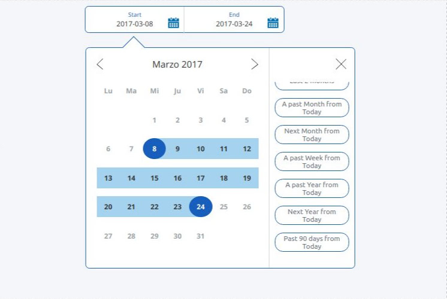

Angular DateRange Picker
---

This date range picker was heavily inspired by PayPal's datepicker as seen on website.

Demo: https://gnurub.github.io/ngx-daterangepicker/



### Installation

NB: if you're still on Angular < 6.0, please use ngx-daterangepicker 0.X.0

```sh
npm install ngx-daterangepicker --save
```

or with YARN

```sh
yarn add ngx-daterangepicker
```

### Example

```ts
import { NgxDateRangePickerModule } from 'ngx-daterangepicker';

// app.module.ts
@NgModule({
  ...
  imports: [ ..., NgxDateRangePickerModule, ... ],
  ...
})
export class AppModule { }
```

```ts
// app.component.ts
import { Component, OnInit } from '@angular/core';
import { NgxDateRangePickerOptions } from 'ngx-daterangepicker';

@Component({
  selector: 'app-root',
  templateUrl: 'app.component.html'
})
export class AppComponent {
  options: NgxDateRangePickerOptions;

  ngOnInit() {
    this.options = {
            theme: 'default',
            labels: ['Start', 'End'],
            menu: [
                {alias: 'td', text: 'Today', operation: '0d'},
                {alias: 'tm', text: 'This Month', operation: '0m'},
                {alias: 'lm', text: 'Last Month', operation: '-1m'},
                {alias: 'tw', text: 'This Week', operation: '0w'},
                {alias: 'lw', text: 'Last Week', operation: '-1w'},
                {alias: 'ty', text: 'This Year', operation: '0y'},
                {alias: 'ly', text: 'Last Year', operation: '-1y'},
                {alias: 'ny', text: 'Next Year', operation: '+1y'},
                {alias: 'lyt', text: 'Last year from today', operation: '-1yt'},
            ],
            dateFormat: 'YYYY-MM-DD',
            outputFormat: 'DD-MM-YYYY',
            startOfWeek: 0,
            outputType: 'object',
            locale: 'es',
            date: {
                from: {
                    year: 2017,
                    month: 3,
                    day: 5
                },
                to: {
                    year: 2017,
                    month: 3,
                    day: 6
                }
            }
        };
  }
}
```

```html
<!-- app.component.html -->
<ngx-daterangepicker [(ngModel)]="value" [options]="options"></ngx-daterangepicker>
```

### Configuration

```ts
export interface NgxDateRangePickerOptions {
    theme: 'default' | 'green' | 'teal' | 'cyan' | 'grape' | 'red' | 'gray';
    range?: string;
    locale?: string;
    labels: string[];
    menu: NgxMenuItem[];
    dateFormat: string;
    outputFormat: string;
    startOfWeek: number;
    outputType?: 'string' | 'object';
    date?: NgxDateRangePickerDates;
}

export interface NgxDateRangePickerDates {
    from: {
        year: number,
        month: number,
        day: number
    }
    to: {
        year: number,
        month: number,
        day: number
    }
}
```

### Running the demo

```sh
git clone https://github.com/GNURub/ngx-daterangepicker.git --depth 1
cd ngx-daterangepicker
npm start
```

### Licence

MIT
